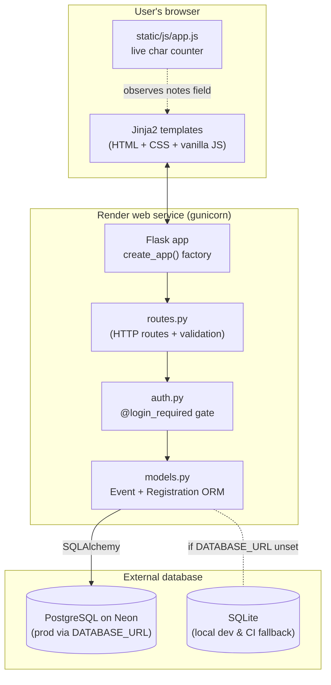
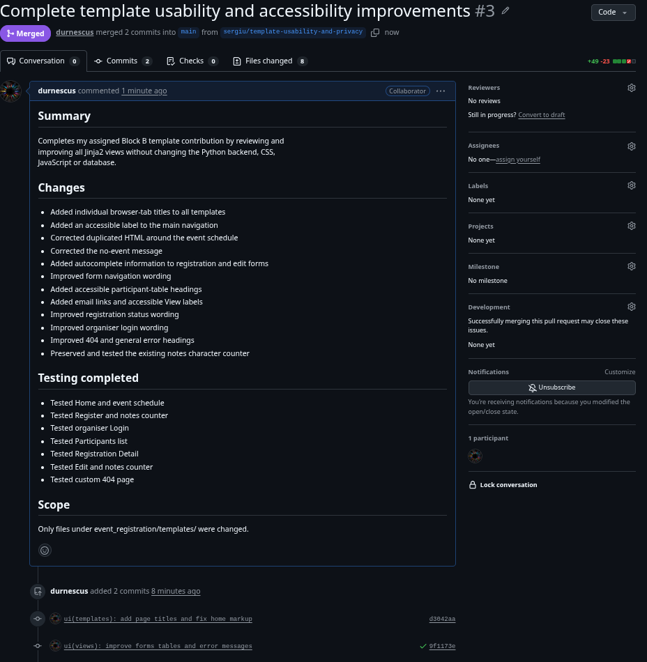
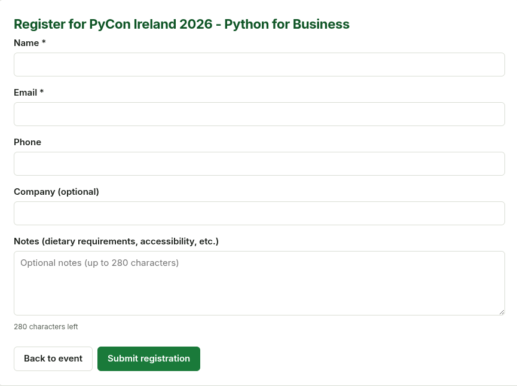
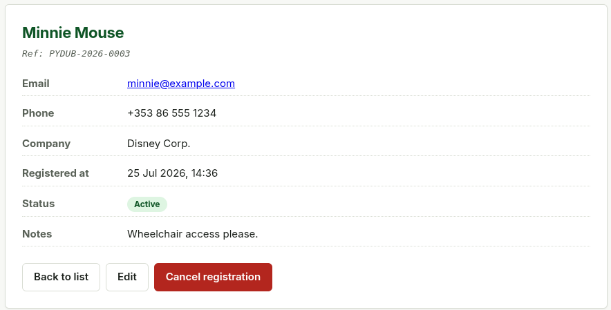
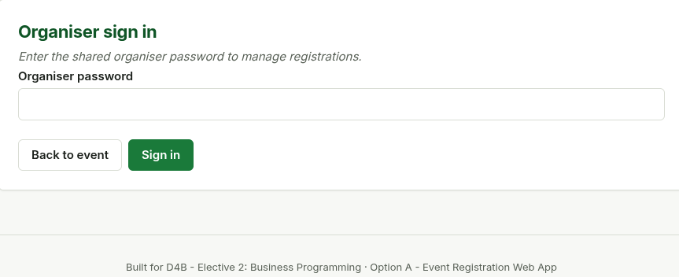
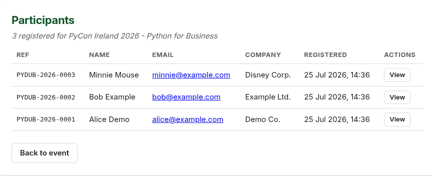
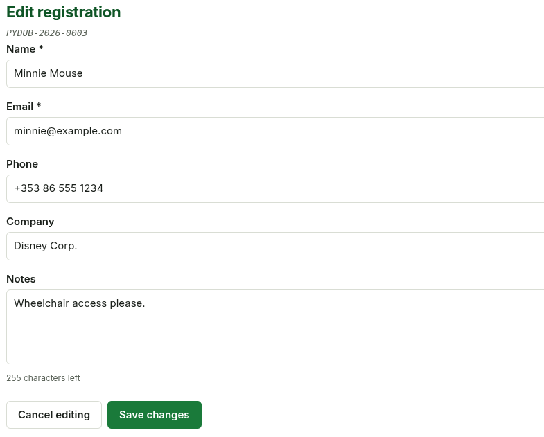
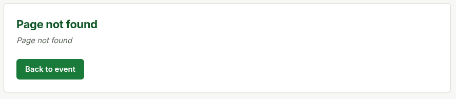

# Short Report — PyDublin Workshop 2026: Event Registration System

> Final length: **target 8 pages** (excluding this markdown's front matter and
> appendices). Export to PDF before submission.

---

## Cover page

- **Project title:** PyDublin Workshop 2026 — Event Registration System
- **Course:** D4B — Elective 2: Business Programming
- **Option:** A - Event Registration Web App
- **Group members:**
  - Michael Newham (261012020) - Block A: Backend & Data (30%)
  - Sergiu D (261024894) - Block B: Client Forms (25%)
  - Paul Sealy (261018041) - Block C: Theme, CSS & JS (25%)
  - Alessandro Genco (262016773) - Block D: Docs, Testing & PM (20%)
- **Date:** 2026-07-25 *(planned submission date — update on final upload)*
- **Live app:** https://pydublin-workshop-registration.onrender.com
- **Source code:** https://github.com/MichaelNewham/pydublin-workshop-registration

---

## 1. Business problem

*~½ page*

**PyCon Ireland 2026 — "Python for Business"** is a small one-day workshop
cap-ed at **40 seats**, organised by a volunteer team with no dedicated
administraïve staff. The organisers need a way for attendees to self-register
online before the event and for the organisers to **manage** those
registrations end-to-end:

- Attendees must be able to **self-register online** (name, email, phone,
  company, optional accessibility notes) without emailing a human, so that
  the data captured matches what is needed for **name badges and catering**.
- The system must **prevent overbooking** by enforcing the venue's 40-seat
  capacity, and **prevent duplicate sign-ups** (one seat per email).
- The organisers must be able to **list, view, edit, and cancel**
  registrations without touching a spreadsheet, so catering and badge counts
  stay accurate in real time.
- Attendee contact details (name, email, phone, accessibility notes) must
  not be scraped by the public internet, but individual attendees must
  still see their own confirmation page after registering.

**Before this project**, registration was run on an Excel spreadsheet
attached to an email thread. That workaround produced three recurring
problems the team wanted to eliminate: (i) **duplicate sign-ups** (the same
person emailed twice and took two seats); (ii) **overbookings** (the
sheet's running count lagged behind reality, so a 41st attendee was
sometimes accepted); and (iii) **lost edits** (a typo'd name on a badge
originated from an out-of-date, locally-saved copy of the sheet). This
project replaces that spreadsheet with a small, web-based, single-source-
of-truth application.

## 2. Solution overview

*~1 page*

A web app built with **Python + Flask + SQLAlchemy + SQLite**, with Jinja2
templates, plain CSS, and a small vanilla-JS interaction. The whole project is
version-controlled in git and auto-deploys to Render on every push, so the
tutor gets a stable public URL with zero human steps after the initial setup.

### Architecture



**Pipeline:** `git push` to `main` → GitHub Actions CI (compile + flake8 +
boot smoke test) → on green, Render Blueprint auto-redeploys from the same
commi and registration data persists in Neon Postgres across redeploys.

### Team workflow

Coordination happened via **feature branches + pull requests** against the
`main` branch on GitHub. Each contributor worked on a branch named
`<owner>/<change>` (e.g. `sergiu/improve-home-layout`) and opened a PR.
Every push - to a branch or to `main` - triggered a GitHub Actions workflow
(`lint-and-boot` job) that installs dependencies, compile-checks every Python
file with `python -m compileall`, runs a focused `flake8` pass for syntax
and undefined-name errors, then boots the app via its `create_app()` factory
and smoke-tests the `/`, `/register`, and `/participants` routes. Only PRs
with a green CI tick were merged. On merge to `main`, Render's Blueprint
pipeline rebuilt and redeployed the public URL automatically - so the tutor
always sees a version of the app that has passed both peer review and
automated checks.

Pull requests landed:

| # | Title | Author | Block |
|---|---|---|---|
| #1 | fix(ui+auth): gate organiser routes + remove over-extrapolated clipboard | `MichaelNewham` | A |
| #2 | Add day-of schedule to home page | `durnescus` (Sergiu) | B |
| #3 | Complete template usability and accessibility improvements | `durnescus` (Sergiu) | B |
| #4 | Add print stylesheet + aria-live on char counter | `sealymonster` (Paul) | C |

PR catalog: https://github.com/MichaelNewham/pydublin-workshop-registration/pulls?q=is%3Apr

### User journeys

- **Attendee:** Home -> Register -> submit -> sees their own confirmation ref
  on the public detail page.
- **Organiser:** Home -> `/login` (shared password) -> Participants ->
  click a row -> Detail -> Edit or Cancel.

## 3. Main features

*~1.5 pages*

| Feature                                    | Where (Flask)                                       |
|--------------------------------------------|-----------------------------------------------------|
| Event information page                     | route `GET /` in `routes.py` -> `templates/home.html` |
| Registration form with server validation   | `GET/POST /register` in `routes.py` -> `templates/register.html` |
| Participant list (auto-updating)           | `GET /participants` -> `templates/participants.html` |
| Detail page per registration               | `GET /registration/<id>` -> `templates/detail.html` |
| Edit registration                          | `GET/POST /registration/<id>/edit` -> `templates/edit.html` (organiser-only) |
| Cancel / restore registration (soft-delete)| `POST /registration/<id>/cancel` and `/restore` (organiser-only) |
| Organiser gate (shared password)           | `event_registration/auth.py` + `/login` route      |
| Two related tables (`Event` < `Registration`) | `models.py`: `Event` + `Registration` with FK   |
| Capacity + duplicate-email enforcement     | `register()` in `routes.py` (SQLAlchemy queries)    |
| HTML / CSS styling                          | `templates/base.html` + `static/css/styles.css` |
| JavaScript interaction (live char counter) | `static/js/app.js` (notes count-down, vanilla JS) |
| Page titles + accessibility pass (Block B, PR #3) | `<title>` block + `aria-label`/`scope="col"` across `templates/*.html` |
| Char-counter `aria-live` (Block C, PR #4)  | `app.js` sets `aria-live="polite"` + `aria-atomic` on every `.js-notes-counter` |
| Print stylesheet ("ticket" printouts) (Block C, PR #4) | `@media print` block in `static/css/styles.css` |

### Screenshots of major screens

The screenshots below were captured against the live deployment at
https://pydublin-workshop-registration.onrender.com by Sergiu D (Block B)
and committed to the repo with his consent. See
`docs/screenshots/PROVENANCE.md` for the per-file attribution.


*Figure 1 — Event information page (`GET /`). Shows the event title,
date, location, price, live "seats remaining" count, the Register CTA,
and the provisional Day-of schedule section added in PR #2.*


*Figure 2 — Registration form (`GET /register`) with name, email, phone,
company, and notes fields. The notes field has the live character counter
(visible below the textarea) — that's the mandated JavaScript
interaction.*


*Figure 4 — Attendee's confirmation page (`GET /registration/<id>`),
reachable but not linked publicly. Shows the registration ref
`PYDUB-2026-XXXX` and the registered details.*


*Figure 5 — Shared-password organiser login (`GET /login`). Replaces
full user accounts for the marking demo (see §7 Limitations).*


*Figure 6 — Participants list seen by the organiser (`GET /participants`
after login), sorted newest-first, with per-row View actions.*


*Figure 7 — Edit-registration form (`GET /registration/<id>/edit`),
organiser-only. All fields pre-populated; notes counter still active.*

> **Outstanding (Block D):** Figures 3 (char-counter in action), 8
> (duplicate-email error), and 9 (sold-out / validation error) are
> referenced in `Short_Report.md` §6.3 but were not in Sergiu's capture.
> Alessandro will re-shoot them during final report assembly.

## 4. Technologies / tools used

*~½ page*

- **Python 3** (3.11+) - the language for both back-end (Flask routes, models)
  and the small client-side JS.
- **Flask** - lightweight WSGI web framework (used in Week 6 of the course).
- **SQLAlchemy** - ORM; declares the two models and their relationship.
- **SQLite** - the database file (`app.db`), created automatically on first run.
- **Jinja2** - HTML templates (ships with Flask).
- **Plain HTML / CSS / vanilla JavaScript** - no external front-end libraries.
- **Git + GitHub** - version control and team collaboration.

Tools for the project itself:

- **GitHub Copilot** - AI pair-programming (see `AI_USE_STATEMENT.md`)
- **Render.com** - push-to-deploy hosting (free tier).
- **GitHub Actions** - CI: compile + boot-test on every PR.

## 5. Database schema

*~½ page*

Two related Data Tables (1-to-many):

```
Event (1) ──────< Registration (N)
                       │ event_id (liveObject link to Event)
```

**Event** columns: `title`, `date`, `location`, `capacity`, `price`, `description`
**Registration** columns: `name`, `email`, `phone`, `company`, `notes`,
                          `status` (registered / cancelled), `created_at`,
                          `event_id` (FK → Event)

Both are declared as SQLAlchemy models in `event_registration/models.py`: `Event`
has a `registrations` relationship; `Registration.event_id` is the foreign key.

## 6. Testing evidence

*~1 page*

Testing happens at three layers: (a) automated **CI** on every commit,
(b) **live smoke tests** against the public Render URL, and (c) **manual
UI tests** in the browser. All three must pass before a change is merged.

### 6.1 Automated - GitHub Actions CI (runs on every push and PR)

The workflow in `.github/workflows/ci.yml` does, in order:

1. `pip install -r requirements.txt`
2. `python -m compileall event_registration run.py` (syntax check every `.py`)
3. `flake8 --select=E9,F63,F7,F82` (catches syntax + undefined-name errors)
4. Boots the app via `create_app()` and asserts `GET /`, `GET /register`,
   and `GET /participants` all return 200 (Flask test client).

Run history: https://github.com/MichaelNewham/pydublin-workshop-registration/actions
Current status as of submission: **all commits on `main` have a green tick**.

### 6.2 Live smoke tests against the Render deployment

These were run against `https://pydublin-workshop-registration.onrender.com`
with `curl` after the deploy stabilised. They prove the production
environment (gunicorn + Render free tier) actually serves each route,
and that the organiser gate works on the public URL:

| Method + Path                            | Expected                       | Actual            |
|------------------------------------------|--------------------------------|-------------------|
| `GET /`                                  | 200 + event title in HTML      | 200, ~2.5 KB      |
| `GET /register`                          | 200 + submit button present    | 200, ~2.6 KB      |
| `POST /register` (valid form data)      | 302 -> `/registration/<id>`    | 302 -> `/registration/3` |
| `GET /registration/<id>`                 | 200 - detail page is PUBLIC    | 200 (attendee's own confirmation) |
| `GET /participants` (no login cookie)    | 302 -> `/login` (gate works)   | 302 to `/login`   |
| `GET /participants` (after `/login`)     | 200 - organiser sees the list  | 200               |
| `POST /login` with wrong password        | 200 (re-renders login form, no session set) | 200, no session |
| `GET /registration/99999`               | 404 via custom error handler   | 404               |

### 6.3 Manual UI tests in the browser

Log of accepted scenarios (each ticked after a real click-through on the
live app):

| # | Scenario                                            | Expected                                   | Pass |
|---|-----------------------------------------------------|--------------------------------------------|------|
| 1 | Open Home with empty DB                              | Demo event auto-creates, page renders      | ✓    |
| 2 | Submit valid registration                            | Row appears in list, confirmation ref shown| ✓    |
| 3 | Submit duplicate email                               | Server blocks with "already registered"    | ✓    |
| 4 | Submit when seats = capacity                         | Server blocks with "sold out"              | ✓    |
| 5 | List participants                                    | All active registrations shown desc by date| ✓    |
| 6 | Edit a registration, save                            | Changes persist after refresh              | ✓    |
| 7 | Cancel a registration                                | Status flips to Cancelled; seat frees up   | ✓    |
| 8 | JS: type in notes field                              | Char counter updates live + turns red >280 | ✓    |
| 9 | Unauthenticated visit to `/participants`              | Redirects to `/login`                      | ✓    |
| 10| Login with wrong password                            | Form re-renders, no session set            | ✓    |
| 11| Refresh Participants after cancelling                | Cancelled row hidden from default view     | ✓    |

The error-path scenarios are illustrated below. Figures 8 (duplicate-email)
and 9 (sold-out / validation) were not part of Sergiu's capture and remain
outstanding for Block D.


*Figure 8 — Custom 404 error page (`templates/error.html`) shown when a
non-existent registration id is requested (smoke-test row in §6.2).*

## 7. Limitations & future improvements

*~½ page*

- **Single shared organiser password** - the gate is a single password shared among the four team members, not per-user accounts. A real production deploy would use Flask-Login with bcrypt-hashed accounts, plus stronger rate-limiting on `/login`.
- **Single event** - the demo seeds one Event row; multi-event would just need
  a list-detail UI on top of the same schema.
- **No payment** — `price` is informational; future: integrate Stripe via
  Flask routes and a hosted checkout.
- **CI runs light checks only** — GitHub Actions currently does compile,
  flake8, and a 3-route boot test. Future: convert the manual UI log from
  §6.3 into a pytest-driven smoke suite so browser flows are covered too.

## 8. AI-use statement

*~¼ page*

See [`AI_USE_STATEMENT.md`](AI_USE_STATEMENT.md) for the full statement. In
short: GitHub Copilot was used for scaffolding config files, CRUD functions,
and documentation drafts; the group corrected validation logic and the
JS hook. All code was reviewed and tested by the team before submission.

---

## Appendix A — How to run

See [`README.md`](README.md) for full instructions. TL;DR:

```bash
pip install -r requirements.txt
python run.py
# open http://localhost:5000
```

Or on Render: `git push` to `main` triggers auto-deploy via the `render.yaml`.
